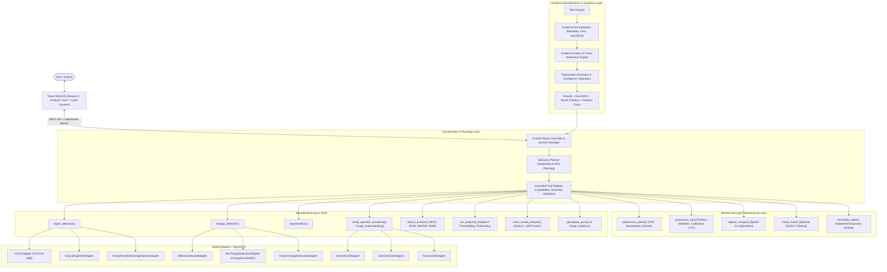

# SatQuery AI (SIH26167): System Architecture Documentation

Interactive Vision-Language Assistant for Multimodal Remote Sensing Image Analysis Through Natural Language Queries.

---

## 1. System Overview

SatQuery AI is a modular, agentic geospatial intelligence system engineered for remote sensing (RS) image analysis. Rather than relying on a monolithic vision-language model (which struggles with sub-pixel spatial accuracy, non-standard sensor channels, and dense geospatial rasters), SatQuery AI separates high-level planning, data preprocessing, specialized analytical tools, model adapters, and evidence fusion into distinct, auditable layers.



---

## 2. Remote Sensing Preprocessing Layer

Remote sensing rasters cannot be directly fed into downstream computer vision models without rigorous preprocessing. Differences in spatial resolution, Coordinate Reference Systems (CRS), sensor geometry, atmospheric distortion, and radiometric calibrations require a dedicated preprocessing pipeline.

```
Data Ingestion ──> Metadata Validation ──> Preprocessing ──> Analysis
```

### Preprocessing Capabilities
1. **CRS Validation and Transformation**: Validates spatial projections and reprojects assets to a common target CRS (e.g., local UTM zones for metric accuracy or `EPSG:4326` for web delivery).
2. **Raster Resampling**: Resolves Ground Sample Distance (GSD) mismatches using interpolation kernels (Bilinear/Cubic for continuous reflectance bands; Nearest Neighbor for categorical mask data).
3. **Band Selection**: Dynamically routes spectral bands based on sensor metadata rather than fixed index assumptions.
4. **Cloud Masking for Optical Imagery**: Extracts cloud and cloud-shadow masks from sensor quality assessment (QA) bands (e.g., Sentinel-2 Scene Classification Layer / SCL, Landsat QA_PIXEL) or machine-learning cloud extractors.
5. **Radiometric Normalization**: Scales top-of-atmosphere (TOA) or surface reflectance (BOA) digital numbers into normalized physical units \([0.0, 1.0]\).
6. **NoData & Border Handling**: Standardizes nodata masks to prevent border artifacts from corrupting convolutional filters or statistics.
7. **Spatial Co-Registration / Image Registration**: Aligns multi-temporal and cross-modal image pairs to sub-pixel accuracy prior to difference or change computation.
8. **Resolution Harmonization**: Matches multi-sensor rasters (e.g., 10m Sentinel-2 with 20m Sentinel-1 or 3m PlanetScope) to a common pixel grid.

### Explicit Preprocessing Tools
- `preprocess_optical()`: Validates metadata, extracts sensor band mapping, handles nodata, resamples, and normalizes optical reflectance.
- `preprocess_sar()`: Validates SAR product metadata, determines acquisition mode/polarization, and prepares radiometric calibration factors.
- `register_images()`: Computes spatial affine or homography transformations to spatially align Image A and Image B.
- `cloud_mask()`: Evaluates quality bands and creates binary cloud/shadow exclusion masks.
- `normalize_raster()`: Applies sensor-aware radiometric scaling and dynamic range percentile stretching.

---

## 3. Image Registration as a First-Class Tool

Multi-temporal change detection and cross-modal comparison inherently fail if rasters are misaligned. Sub-pixel spatial offsets produce massive false-positive edges ("edge glare") along roads, coastline boundaries, and building perimeters.

```
Image A (Time T1) ──> Preprocessing ──> Spatial Registration ──┐
                                                               ├──> Change Detection Engine
Image B (Time T2) ──> Preprocessing ──> Spatial Registration ──┘
```

The `register_images()` tool:
- Uses phase correlation, feature matching (SIFT/ORB), or mutual information algorithms to detect spatial drift between multi-temporal passes.
- Computes warping transforms to bring secondary rasters into exact pixel alignment with reference baselines.
- Explicitly reports registration quality metrics (Root Mean Square Error in pixels) to the evidence layer.

---

## 4. Optical Remote Sensing Pipeline

Optical analysis must never assume fixed band positions. Band designations differ across satellites:
- **Sentinel-2 MSI**: Blue = B2, Green = B3, Red = B4, NIR = B8 (10m) / B8A (20m), SWIR1 = B11, SWIR2 = B12 (20m).
- **Landsat 8/9 OLI**: Blue = B2, Green = B3, Red = B4, NIR = B5, SWIR1 = B6, SWIR2 = B7.
- **PlanetScope**: Blue = B1, Green = B2, Red = B3, NIR = B4.

```
Raw Optical Imagery ──> Metadata Validation ──> Cloud Masking ──> Band Alignment/Resampling ──> Spectral Index Calculation ──> Downstream Analysis
```

### Supported Biophysical Indices
- **NDVI (Normalized Difference Vegetation Index)**:
  $$\text{NDVI} = \frac{\rho_{\text{NIR}} - \rho_{\text{Red}}}{\rho_{\text{NIR}} + \rho_{\text{Red}}}$$
  Measures photosynthetic canopy vigor and biomass density.
- **NDWI (Normalized Difference Water Index - McFeeters)**:
  $$\text{NDWI} = \frac{\rho_{\text{Green}} - \rho_{\text{NIR}}}{\rho_{\text{Green}} + \rho_{\text{NIR}}}$$
  Delineates open surface water bodies by suppressing soil and terrestrial vegetation.
- **MNDWI (Modified Normalized Difference Water Index - Xu)**:
  $$\text{MNDWI} = \frac{\rho_{\text{Green}} - \rho_{\text{SWIR}}}{\rho_{\text{Green}} + \rho_{\text{SWIR}}}$$
  Replaces NIR with SWIR to eliminate false water classifications caused by built-up urban structures.
- **NDBI (Normalized Difference Built-up Index)**:
  $$\text{NDBI} = \frac{\rho_{\text{SWIR}} - \rho_{\text{NIR}}}{\rho_{\text{SWIR}} + \rho_{\text{NIR}}}$$
  Identifies impervious surfaces, urban sprawl, and concrete infrastructure.

---

## 5. Synthetic Aperture Radar (SAR) Pipeline

SAR backscatter is an active microwave measurement governed by complex scattering physics. It must not be evaluated using simplistic, universal hardcoded thresholds.

```
Input SAR Product ──> Product Validation ──> Radiometric Calibration ──> Speckle Filtering (Lee/Frost) ──> Geometric/Terrain Processing ──> Backscatter Analysis ──> Contextual Interpretation
```

### Radiometric Calibration Principles
SAR radiometric calibration converts raw digital numbers (DN) into physically meaningful radar cross-section measurements (Sigma-Nought $\sigma^0$, Gamma-Nought $\gamma^0$, or Beta-Nought $\beta^0$).
- Procedure is **product-aware**: On Sentinel-1 Level-1 Ground Range Detected (GRD) products, calibration uses sensor calibration lookup tables (LUTs) embedded in product XML metadata:
  $$\sigma^0_i = \frac{\text{DN}_i^2}{A_i^2}$$
  where $A_i$ is the calibration vector value for pixel $i$.
- Where appropriate for dynamic range compression, calibrated sigma-nought may be expressed in decibels ($\text{dB}$):
  $$\sigma^0_{\text{dB}} = 10 \cdot \log_{10}(\sigma^0)$$

### Non-Universal, Scene-Dependent Interpretation
SAR backscatter values depend heavily on:
1. **Sensor & Acquisition Parameters**: Wavelength/frequency band (C-band, X-band, L-band), acquisition mode (IW, EW, Stripmap), polarization (VV, VH, HH, HV), and local incidence angle ($\theta$).
2. **Environmental & Surface Conditions**: Surface dielectric constant (soil moisture, water salinity), micro-scale surface roughness relative to radar wavelength, and wind-induced capillary wave turbulence on water surfaces.
3. **Geometric & Topographic Effects**: Radar shadow, layover, and foreshortening in rugged terrain.

### Water, Flood, and Metallic Target Detection
- **Open Water / Inundation**: Smooth, calm open water acts as a specular reflector, scattering microwave energy away from the radar sensor and resulting in low backscatter. However, wind-roughened waters, emergent vegetation, and flooded forests exhibit high backscatter. Low calibrated backscatter may be consistent with open water, subject to scene-specific conditions. The system employs **scene-adaptive thresholding** (e.g., Otsu thresholding on localized water basins, Bimodal Gaussian Mixture Models) rather than rigid thresholds.
- **Metallic / High-Density Structures**: Double-bounce dihedral reflections (corner reflectors formed by vertical walls meeting flat surfaces or ship hulls meeting calm sea) produce elevated radar returns. Elevated backscatter may indicate metallic or structural features, subject to validation against local geometry and orientation.

---

## 6. Cross-Modal (Optical + SAR) Fusion Pipeline

Optical imagery and SAR provide complementary physical observations:
- **Optical**: Reflectance in solar reflective spectrum (chemical composition, chlorophyll absorption, pigment signatures). Limited by cloud cover, atmospheric haze, and daylight.
- **SAR**: Active microwave backscatter (dielectric properties, structural geometry, surface roughness). Day/night, all-weather cloud penetration.

```
Optical Imagery ──> Optical Preprocessing ──> Optical Features ──┐
                                                                 ├──> Co-Registration ──> Feature & Evidence Fusion ──> Integrated Analysis
SAR Imagery     ──> SAR Preprocessing     ──> SAR Features     ──┘
```

### True Sensor Fusion vs. Naive VLM Prompting
SatQuery AI does not simply concatenate two image rasters into an off-the-shelf vision-language prompt. True cross-modal fusion occurs at the feature and evidence levels:
1. **Cloud Penetration & Gap Filling**: When optical cloud masking flags an AOI as obscured, co-registered SAR backscatter maps ground features (e.g., flood boundaries, coastal shorelines).
2. **Infrastructure & Vessel Confirmation**: Potential targets flagged in optical data are cross-referenced with co-registered SAR backscatter to confirm double-bounce dihedral signatures, eliminating cloud false positives and sun glint anomalies.
3. **Flood Inundation Verification**: Optical water indices (MNDWI) are cross-checked with SAR low-backscatter delineations to disambiguate terrain shadows from standing floodwaters.

---

## 7. Model Adapter Architecture

To prevent vendor lock-in and decouple high-level planning from specific neural networks, tools interact with machine learning models through abstract **Model Adapters**.

```
Agent / Planner
       │
       ▼
Specialized Tool (e.g., ObjectDetectionTool)
       ├──> YOLOAdapter (Ultralytics YOLOv8-OBB for fast oriented bounding boxes)
       ├──> GroundingDINOAdapter (Open-vocabulary transformer detection)
       └──> FutureRemoteSensingDetectorAdapter (Domain-specific fine-tuned models)

Specialized Tool (e.g., ChangeDetectionTool)
       ├──> DifferenceBasedAdapter (Spectral magnitude and Otsu thresholding)
       ├──> MLChangeDetectionAdapter (Transformer-based ChangeFormer/BIT)
       └──> FutureChangeDetectionAdapter

Specialized Tool (e.g., VisualQuestionAnsweringTool)
       ├──> GeminiVLMAdapter (Google Gemini Multimodal API)
       ├──> GeoChatVLMAdapter (Fine-tuned Remote Sensing LLaVA model)
       └──> FutureVLMAdapter
```

The Planner Agent depends only on the tool contract. If a backend model changes from Grounding DINO to an internal remote sensing model, no changes are required in the agent orchestration logic.

---

## 8. Controlled Tool Registry Architecture

The Planner operates under strict least-privilege principles with **no arbitrary code execution**. Every available capability is encapsulated in a formal, schema-validated tool registered with the `ToolRegistry`.

```
SatQuery Planner ──> Tool Registry ──> Available Tool Catalog ──> Validated Tool Execution ──> Evidence Output
```

### Tool Definition Contract
Every registered tool must explicitly specify:
- `name`: Unique canonical identifier (e.g., `object_detection`).
- `description`: Domain-specific purpose and appropriate triggering context.
- `input_schema`: Strict Pydantic model declaring required and optional parameters.
- `output_schema`: Strict Pydantic model defining returned evidence, metrics, and geometries.
- `execute(**kwargs)`: Deterministic execution method.
- `capabilities`: Operational bounds (e.g., `["multispectral", "bounding_box_extraction"]`).
- `supported_data_types`: Compatible rasters and vectors (e.g., `["GeoTIFF", "COG", "GeoJSON"]`).
- `limitations`: Known operational constraints (e.g., `"Unreliable over heavy cloud cover (>70%)"`).

---

## 9. Structured Planner Execution Plan

When an analyst issues a natural-language query, the Planner does not jump directly to an answer. It decomposes the intent into an explicit, sequential or DAG-based execution plan.

### Example: Multi-Temporal Building Change Query
**User Query**: *"Find new buildings between the 2022 and 2025 images in the selected harbor sector."*

**Generated Execution Plan**:
```
Step 1:  [validate_imagery]    Verify temporal imagery assets (2022 baseline & 2025 comparison).
Step 2:  [inspect_metadata]    Inspect sensor, GSD, and CRS for both acquisitions.
Step 3:  [preprocess_optical]  Apply cloud masking, band normalization, and nodata handling.
Step 4:  [register_images]     Perform spatial co-registration between 2022 and 2025 rasters.
Step 5:  [object_detection]    Execute building detection on 2022 preprocessed raster.
Step 6:  [object_detection]    Execute building detection on 2025 preprocessed raster.
Step 7:  [change_detection]    Compare detection footprints spatially using vector topology.
Step 8:  [geospatial_query]    Filter new candidate structures and compute surface area in m².
Step 9:  [evidence_fusion]     Synthesize detection counts, change polygons, and confidence scores.
Step 10: [explanation_gen]     Produce evidence-backed markdown explanation with GeoJSON overlays.
```

---

## 10. Evidence Normalization & Fusion Layer

To prevent fragmented, conflicting tool outputs, all intermediate results pass through an **Evidence Normalization and Fusion Layer** before explanation generation.

```
Specialized Tools ──> Evidence Normalization ──> Evidence Fusion ──> Explanation Generator ──> Final Result
```

### Structured Evidence Schema
Each normalized evidence item records:
- `source_image`: Asset ID, sensor name, and acquisition date.
- `timestamp`: Acquisition timestamp of the satellite observation.
- `spatial_extent`: Bounding box or polygon coordinates in WGS84 (`EPSG:4326`).
- `detected_object_or_region`: Semantic category or feature type.
- `confidence`: Calibrated, metric-specific confidence value.
- `model_tool_used`: Specific tool and model adapter responsible for the evidence.
- `processing_steps`: Sequence of preprocessing and analytical operations executed.
- `measurements`: Quantitative biophysical or geometric metrics (e.g., area in $\text{m}^2$, backscatter in $\text{dB}$, spectral index value).
- `geojson_geometry`: Standard RFC 7946 GeoJSON representation.

---

## 11. Explicit Confidence Semantics

Confidence metrics from heterogeneous remote sensing algorithms are fundamentally distinct and cannot be averaged naively:
1. **Model Confidence**: Raw Softmax or Sigmoid probability output by a neural network classifier/detector (e.g., YOLO detection confidence = 0.88).
2. **Detection Confidence**: Post-thresholded score incorporating spatial Intersection over Union (IoU) and non-maximum suppression stability.
3. **Change Score**: Biophysical magnitude of radiometric/vector divergence between two aligned acquisitions ($0.0 = \text{no change}$, $1.0 = \text{extreme shift}$).
4. **Rule-Based Evidence**: Logical heuristic verification score (e.g., cross-modal agreement between optical detection and radar backscatter).
5. **Overall Result Confidence**: A composite, calibrated metric summarizing the holistic consistency of evidence across preprocessing quality, sensor resolution, and multi-tool agreement.

Confidence values are never fabricated; if a model cannot provide an empirical uncertainty metric, the system explicitly reports confidence as uncalibrated or qualitative.

---

## 12. Pragmatic Data Pipeline & Storage Architecture

The architecture separates lightweight prototype operation from enterprise production storage:
- **Raster Data**: Standard GeoTIFF and Cloud-Optimized GeoTIFF (COG). Windowed reading is executed via Rasterio / GDAL to avoid loading gigabyte-scale scenes into memory.
- **Vector Overlays**: Standard RFC 7946 GeoJSON `FeatureCollection` structures for client-side rendering.
- **Metadata Management**: SpatioTemporal Asset Catalog (STAC) specifications for cataloging and searching scene footprints.
- **Spatial Database**: PostgreSQL + PostGIS is treated as an **optional production component**. For the MVP and local hackathon environments, spatial queries are executed locally in memory using Shapely and GeoPandas, ensuring zero database installation friction.

---

## 13. Client WebGIS & Analysis Trace

The frontend interface replaces opaque "thought inspectors" with a transparent, user-facing **Analysis Trace**:

```
+---------------------------------------------------------------------------------------------------+
|  SatQuery AI  |  [Asset: Sentinel-2 Mumbai Harbor 2026-03-01]  |  [Mode: Optical + SAR]  | [Help] |
+-----------------------------------------------------------------+---------------------------------+
|                                                                 |  AI Assistant & Chat Drawer     |
|   Interactive WebGIS Viewport (Leaflet / MapLibre)              |                                 |
|                                                                 |  User: "Detect new port berths  |
|   +---------------------------------------------------------+   |         between 2022 and 2025." |
|   | Map Tools: [Zoom] [Draw AOI] [Measure] [Swipe Split]    |   |                                 |
|   +---------------------------------------------------------+   |  Analysis Trace:                |
|                                                                 |  [✓] Query classified           |
|   [ Layer Controls ]                                            |  [✓] Required imagery validated |
|   [x] Preprocessed Optical (2025)                               |  [✓] Preprocessing selected     |
|   [x] Co-registered Optical (2022)                              |  [✓] Spatial co-registration    |
|   [x] Detected Berth Additions (GeoJSON Polygons)               |  [✓] Change detection executed  |
|   [x] Cross-Modal SAR Verification Overlay                      |  [✓] Evidence synthesized       |
|                                                                 |                                 |
|                                                                 |  Explanation:                   |
|                                                                 |  "Analysis reveals 2 new port   |
|                                                                 |   berths constructed along the  |
|                                                                 |   eastern wharf, covering       |
|                                                                 |   14,200 sq meters..."          |
+-----------------------------------------------------------------+---------------------------------+
|  Timeline: [2022-02-15 | Optical] ------------ [2025-03-10 | Optical] ---- [2025-03-12 | SAR]     |
+---------------------------------------------------------------------------------------------------+
```

### Analysis Trace Events
The system does not expose raw chain-of-thought or model internal monologue. The Analysis Trace displays structured, safe execution milestones:
1. `Query classified` (identifies analytical domain, e.g., change detection + maritime).
2. `Required imagery identified` (checks available optical/SAR scenes and temporal baselines).
3. `Preprocessing selected` (cloud masking, band selection, resampling).
4. `Spatial co-registration` (sub-pixel alignment of multi-temporal rasters).
5. `Tool selected` (invokes specific analysis tool from registry).
6. `Analysis executed` (reports execution status and elapsed time).
7. `Evidence generated` (summarizes counts, indices, and candidate regions).
8. `Results synthesized` (produces calibrated explanation and GeoJSON layers).

---

## 14. Phased Implementation Roadmap

To ensure pragmatic delivery, capabilities are partitioned into distinct, progressive phases:

- **Phase 1: Core Ingestion, Metadata & Conversational MVP**
  - Image upload and local GeoTIFF reading.
  - Scene metadata validation (CRS, GSD, sensor, bands).
  - Natural language query input and Planner intent classification.
  - Baseline VQA / scene understanding tool.
  - Structured output payload with user-facing **Analysis Trace**.
- **Phase 2: Object Detection & Spatial Overlays**
  - Model adapter integration for object detection (YOLOv8-OBB / Grounding DINO).
  - Horizontal and oriented bounding box extraction.
  - Interactive GeoJSON vector overlay rendering on Leaflet map.
- **Phase 3: Multi-Temporal Registration & Change Detection**
  - Implementation of `register_images()` spatial co-registration tool.
  - Bi-temporal change detection engine (Difference-based and ML adapter).
  - Delineation of change polygon geometries and surface area calculation.
- **Phase 4: Optical Preprocessing & Biophysical Spectral Indices**
  - `preprocess_optical()` and `cloud_mask()` tools.
  - Analytical computation of NDVI, NDWI, MNDWI, and NDBI.
  - Sensor-aware band routing (Sentinel-2, Landsat, PlanetScope).
- **Phase 5: SAR Preprocessing & Scene-Adaptive Analysis**
  - `preprocess_sar()` with product-aware radiometric calibration.
  - Refined Lee speckle filtering.
  - Scene-adaptive water/inundation thresholding and double-bounce detection.
- **Phase 6: Cross-Modal (Optical + SAR) Feature Fusion**
  - Cross-modal co-registration and feature alignment pipeline.
  - Cloud-penetration gap filling and structural verification algorithms.
  - Joint evidence synthesis and contradiction resolution.
- **Phase 7: Advanced Agentic Orchestration & Production Deployment**
  - Dynamic multi-branch DAG planning and self-correction loops.
  - Optional PostGIS database connection and STAC client integration.
  - Full production performance optimization and export capabilities.

---

## 15. Scientific and Operational Limitations

To maintain scientific integrity and operational credibility:
1. **Sensor & Acquisition Dependency**: Remote sensing results are bounded by Ground Sample Distance (GSD), spectral coverage, radiometric resolution, look angle, and atmospheric conditions at the instant of capture.
2. **Model Confidence vs. Ground Truth**: Machine learning confidence scores denote statistical model certainty relative to training distributions; they do not represent infallible physical ground truth.
3. **Scene-Dependent SAR Interpretation**: Radar backscatter is governed by surface dielectric properties, micro-roughness, local incidence angle, and moisture. No universal decibel threshold exists for water or structural features.
4. **Atmospheric & Cloud Contamination**: Passive optical sensors are subject to cloud occlusion, cloud shadows, and aerosol scattering. Cloud masking reduces but cannot eliminate atmospheric contamination in hazy scenes.
5. **Registration & Alignment Sensitivity**: Automated change detection is sensitive to residual co-registration errors. Sub-pixel misalignment can introduce spurious change detections along sharp edges.
6. **Decision-Support Classification**: SatQuery AI is engineered as an **analytical decision-support assistant**. Automated outputs must be verified by certified remote sensing specialists prior to high-stakes defense, disaster response, or legal deployment.
